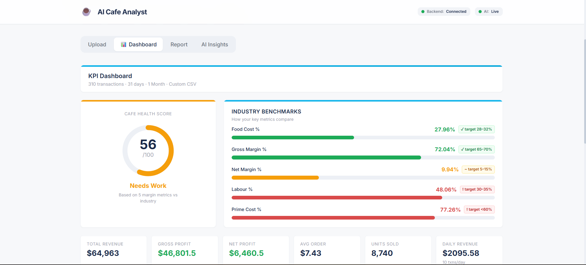
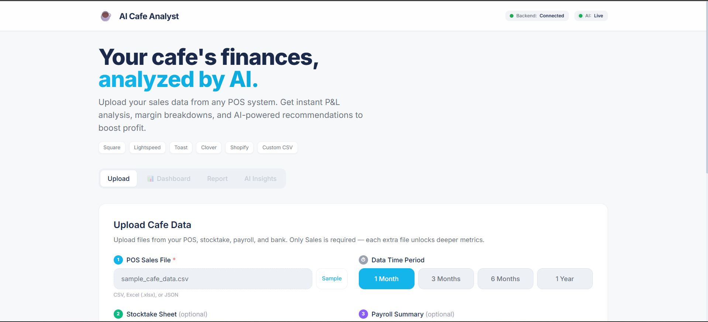
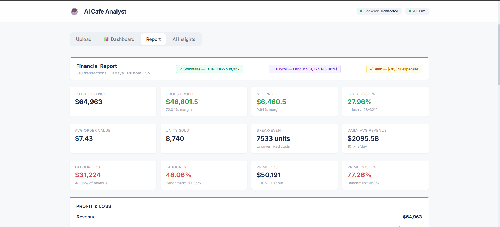
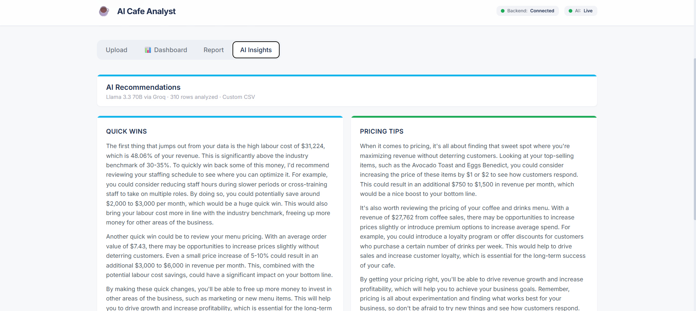

# ☕ AI Cafe Analyst

**AI-powered financial analysis for cafes and small food businesses.**

Upload your sales CSV → get instant P&L, margin analysis, and AI-driven recommendations to boost profit.

> 🤖 AI by Llama 3.3 70B (free via Groq) · 🚀 Deployed on Vercel (free) · 💰 Total cost: $0/month

---

## Screenshots






---

## What It Does

### 📊 Financial Analysis
- **Profit & Loss** — Revenue, COGS, gross profit, net profit
- **Margin Analysis** — Gross margin %, net margin %, food cost %
- **Break-Even** — How many units needed to cover fixed costs
- **Per-Item Breakdown** — Top sellers vs worst performers
- **Category Analysis** — Which menu categories are most profitable
- **Daily Trends** — Average daily revenue and transactions

### 🤖 AI Recommendations
- Cost reduction strategies
- Pricing recommendations for specific items
- Menu optimization (what to promote, what to cut)
- Labor and operational efficiency tips
- Revenue growth opportunities
- Cash flow management advice

---

## Tech Stack

| Layer | Technology |
|-------|------------|
| **Frontend** | React + Vite + TailwindCSS |
| **API** | Python (stdlib only — zero dependencies) |
| **AI** | Llama 3.3 70B via Groq (free tier) |
| **Hosting** | Vercel Serverless (free tier) |
| **Cost** | **$0/month** |

---

## Running Locally

### Prerequisites
- Node.js 18+
- Python 3.9+
- Groq API key (free at [console.groq.com](https://console.groq.com))

### Frontend

```bash
cd frontend
npm install
npm run dev
```

Open `http://localhost:3000`

### API

The API uses only Python standard library — no pip install needed.

```bash
# Set your Groq API key
export GROQ_API_KEY="your_key_here"

# On Windows PowerShell:
$env:GROQ_API_KEY="your_key_here"
```

---

## CSV Format

Your CSV should have these columns (flexible naming accepted):

| Column | Description | Example |
|--------|-------------|---------|
| `date` | Transaction date | 2026-01-15 |
| `item` | Menu item name | Flat White |
| `category` | Item category | Coffee |
| `price` | Selling price per unit | 5.50 |
| `cost` | Cost price per unit | 1.20 |
| `quantity` | Units sold | 45 |

A sample CSV is included in `sample_data/cafe_sales.csv`, or click **"Try with Sample Data"** in the app.

---

## Deploy to Vercel (Free — 2 minutes)

### 1. Push to GitHub

```bash
git init
git add .
git commit -m "Initial commit"
git remote add origin https://github.com/YOUR_USERNAME/AI-Cafe-Analyst.git
git push -u origin main
```

### 2. Deploy API

1. Go to [vercel.com](https://vercel.com) → New Project
2. Import this repo
3. Root directory: `./` (default)
4. Add environment variable: `GROQ_API_KEY` = your key
5. Deploy ✅

### 3. Deploy Frontend

1. Create another Vercel project
2. Import same repo
3. Root directory: `frontend`
4. Add environment variable: `VITE_API_URL` = your API URL from step 2
5. Deploy ✅

---

## API Endpoints

| Method | Endpoint | Description |
|--------|----------|-------------|
| `GET` | `/api/` | API info and status |
| `GET` | `/api/health` | Health check |
| `POST` | `/api/analyze` | Analyze cafe data |

### POST /api/analyze

```json
{
  "csv": "date,item,category,price,cost,quantity\n2026-01-01,Flat White,Coffee,5.50,1.20,45",
  "fixed_costs": 3500
}
```

**Response**: Financial metrics + AI recommendations.

---

## Cost Breakdown

| Service | Tier | Monthly Cost |
|---------|------|--------------|
| Vercel (API) | Hobby | $0 |
| Vercel (Frontend) | Hobby | $0 |
| Groq AI | Free | $0 |
| **Total** | | **$0** |

---

## License

MIT
